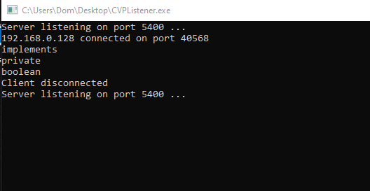

# CVP_TCP_Listener
A simple TCP server that runs in loop to listen for messages

License: GNU GPL 3.0

## Objective of the project
Create a simple listener to test a group project we are building in school<br/>
[CVP project](https://gitlab.com/l454/CVP)

## Usage
Simply build with an IDE, <br/>
or compile with gcc:
```gcc CVP_TCP_Listener.cpp -o outputfile.exe```

## Screenshot

